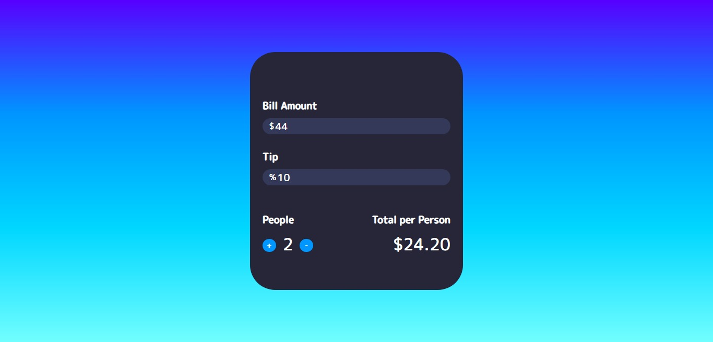

# tip-calculator
calculate your tips and split your bills using this <b>tip calculator</b>.
 
 
 
<h2>languages-used</h2>
<ul>
<li><h4>HTML</h4></li>
<li><h4>CSS</h4></li>
<li><h4>JAVASCRIPT</h4></li>
</ul>
 
 
 
<h2>preview</h2>

 
 
 
 
<h2>creator-socials</h2>

</h2>

